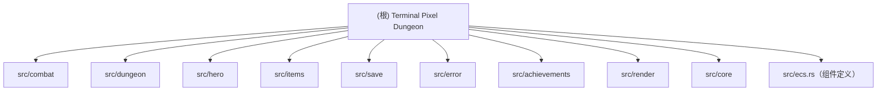

# CLAUDE.md

本文件为 Claude Code (claude.ai/code) 在处理此代码库时提供指导。

## 项目概述

Terminal Pixel Dungeon 是一个基于终端的 Roguelike 地牢探险游戏，灵感来自 Shattered Pixel Dungeon。使用 Rust 和 ECS（实体组件系统）架构构建。

## 核心架构理念

### 双重架构设计
项目采用了 **ECS + 模块化子系统** 的混合架构：

1. **ECS 层（Entity-Component-System）**
   - 基于 `hecs` 库实现
   - 管理游戏实体、组件和系统
   - 位于 `src/ecs.rs` 和 `src/systems.rs`
   - 组件包括：Position, Actor, Stats, Inventory, Viewshed, Energy, AI, Renderable, Tile, Hunger, Wealth, PlayerProgress, StatusEffects, BossComponent 等

2. **模块化子系统**
   - 独立的 workspace crates 位于 `src/` 下
   - 主要模块：`combat`, `dungeon`, `hero`, `items`, `save`, `error`, `achievements`
   - 通过事件总线（`event_bus.rs`）解耦通信
   - 每个模块有独立的 `Cargo.toml` 和完整的功能实现

3. **适配器层**
   - `hero_adapter.rs` 用于桥接 ECS 实体和 Hero 模块
   - `core.rs` 提供核心游戏引擎统一接口
   - `core/entity_factory.rs` 用于创建游戏实体

### 关键系统交互

- **回合系统（Turn System）**: `turn_system.rs` 管理基于能量的回合调度
- **战斗系统**: 分布在 `src/combat/` 模块和 `systems.rs` 中的 CombatSystem
- **视野系统（FOV）**: 支持 ShadowCasting/DiamondWalls/RayCasting 三种算法
- **地牢生成**: `dungeon` 模块负责房间、走廊和陷阱的生成
- **自动保存**: `save` 模块提供自动保存功能（默认5分钟间隔）

### 回合管道阶段
游戏循环按以下确定性阶段执行：
1. PreInput: 时间/时钟更新
2. Input: 输入处理和菜单
3. IntentGathering: AI 决策
4. ActionResolution: 移动、FOV、战斗、效果、库存、饥饿、地牢
5. PostTurnUpkeep: 回合结束时的清理和更新
6. Render: 渲染输出

## 模块结构图



## 模块索引

| 模块路径 | 职责 | 入口文件 | 测试文件 |
|----------|------|----------|----------|
| `src/combat/` | 战斗解算、命中/闪避、暴击、潜行攻击、状态效果 | `src/combat/src/lib.rs` | `src/combat/src/tests.rs` |
| `src/dungeon/` | 地牢生成算法、房间布局、陷阱系统 | `src/dungeon/src/lib.rs` | 无专用测试文件 |
| `src/hero/` | 角色类别（战士/盗贼/法师/猎手）、背包、装备 | `src/hero/src/lib.rs` | 无专用测试文件 |
| `src/items/` | 武器、护甲、药水、卷轴、戒指、魔杖、食物、投掷武器等 | `src/items/src/lib.rs` | 无专用测试文件 |
| `src/save/` | 自动保存、bincode 序列化、存档管理 | `src/save/src/lib.rs` | 内联测试 |
| `src/error/` | 错误处理、类型定义 | `src/error/src/lib.rs` | 无专用测试文件 |
| `src/achievements/` | 成就系统、进度追踪 | `src/achievements/src/lib.rs` | `src/achievements/src/tests.rs` |
| `src/render/` | 渲染组件（地牢/HUD/物品栏/菜单/Boss/职业选择/游戏结束） | `src/render/mod.rs` | 无专用测试文件 |
| `src/core/` | 核心引擎、实体工厂、游戏状态 | `src/core.rs` + `src/core/entity_factory.rs` | 无专用测试文件 |
| `src/ecs.rs` | ECS 组件定义和资源 | `src/ecs.rs` | 内联测试 |
| `src/event_bus.rs` | 事件总线系统、发布-订阅机制 | `src/event_bus.rs` | 内联测试 |
| `src/systems.rs` | ECS 系统实现 | `src/systems.rs` | 无 |

### 集成测试目录
| 测试文件 | 测试内容 |
|----------|----------|
| `tests/adapters_eventbus_tests.rs` | 适配器与事件总线集成 |
| `tests/ai_energy_integration_test.rs` | AI 与能量系统集成 |
| `tests/class_skills_test.rs` | 职业技能测试 |
| `tests/dungeon_turn_costs_test.rs` | 地牢移动消耗测试 |
| `tests/effect_system_tests.rs` | 效果系统测试 |
| `tests/event_bus_taxonomy_tests.rs` | 事件总线分类测试 |
| `tests/hunger_system_tests.rs` | 饥饿系统测试 |
| `tests/save_turn_state_integration.rs` | 存档与回合状态集成测试 |

## 运行与开发

### 构建与运行
```bash
# 开发模式运行
cargo run

# 发布模式运行（推荐，性能更好）
cargo run --release

# 构建所有工作区成员
cargo build --workspace

# 构建单个模块（例如 combat）
cargo build -p combat
```

### 测试
```bash
# 运行所有测试
cargo test --workspace

# 运行特定模块测试
cargo test -p combat
cargo test -p dungeon

# 运行特定测试（例如战斗系统测试）
cargo test combat_system

# 显示测试输出
cargo test -- --nocapture
```

### 代码检查
```bash
# 代码格式化
cargo fmt

# Clippy 检查
cargo clippy --workspace -- -D warnings

# 检查所有 crate
cargo check --workspace
```

## 测试策略

项目包含多种测试层级：
- **单元测试**: 各模块的内联测试（`#[cfg(test)] mod tests`）
- **集成测试**: `tests/` 目录下的独立测试文件
- **模块测试**: `src/combat/src/tests.rs`, `src/achievements/src/tests.rs` 等

需要补充测试的模块：`dungeon`, `hero`, `items`, `error`, `render`

## 重要的代码位置

### 核心游戏循环
- **入口点**: `src/main.rs` - 初始化终端、渲染器和游戏循环
- **游戏循环**: `src/game_loop.rs` - 协调 ECS 系统执行
- **系统执行顺序**: PreInput > Input > IntentGathering > ActionResolution > PostTurnUpkeep > Render

### ECS 核心
- **组件定义**: `src/ecs.rs` - 所有 ECS 组件和资源
- **系统实现**: `src/systems.rs` - 所有游戏系统的逻辑
- **实体工厂**: `src/core/entity_factory.rs` - 创建玩家、敌人、物品实体

### 模块化子系统
- **战斗模块**: `src/combat/` - 战斗解算、命中/闪避、暴击、潜行攻击、状态效果
- **地牢模块**: `src/dungeon/` - 地牢生成算法、房间布局、陷阱系统
- **英雄模块**: `src/hero/` - 角色类别（战士、盗贼、法师、猎手）、背包、装备
- **物品模块**: `src/items/` - 武器、护甲、药水、卷轴、戒指、魔杖、食物
- **渲染模块**: `src/render/` - 地牢/HUD/物品栏/菜单渲染组件

### 关键机制文件
- **战斗计算**: `src/combat/src/combat_manager.rs`
- **战斗特质**: `src/combat/src/combatant.rs` - Combatant trait 定义
- **视野系统**: `src/combat/src/vision.rs` - FOV 和潜行检测
- **回合管理**: `src/turn_system.rs` - 基于能量的回合系统
- **事件总线**: `src/event_bus.rs` - 模块间通信

## 战斗系统重要细节

战斗系统模仿 Shattered Pixel Dungeon 的机制：

### 命中计算
```
hit_chance = BASE_HIT_CHANCE + (accuracy - evasion) / 20
```
- 基础命中率：80%
- 最小命中率：5%
- 最大命中率：95%

### 伤害计算
```
damage = base_damage x random(0.8-1.2) x crit_multiplier x ambush_multiplier - defense
```
- 暴击倍数：1.5x
- 潜行攻击倍数：2.0x
- 防御上限：最多减少 80% 伤害
- 最小伤害：1

### 潜行攻击判定
当攻击者不在防御者的视野范围内时触发潜行攻击，造成 2 倍伤害。视野计算使用 FOV 算法（ShadowCasting/DiamondWalls/RayCasting），考虑地形阻挡。

### 状态效果
支持 15+ 种状态效果，包括：燃烧、中毒、流血、麻痹、隐身、缓慢、急速、狂暴、冰冻等。状态效果在 `src/combat/src/status_effect.rs` 和 `src/combat/src/effect.rs` 中定义。

## 开发约定

### 借用检查注意事项
在 inventory 和 hero 系统中存在复杂的借用关系，修改时需要特别注意：
- 背包系统使用 `Bag` 包装 `Inventory` 和 `Equipment`
- 使用装备时需要分离可变借用和不可变借用
- 参考 `src/hero/src/core/item/equip.rs` 和 `src/hero/src/bag/inventory.rs` 的实现

### ECS 实体访问
- 使用辅助函数查找实体：`get_dungeon_clone()`, `set_dungeon_instance()` 等
- 地牢状态通过 `DungeonComponent` 组件附加到实体上

### 坐标系统
- Position 使用 `(x, y, z)` 坐标，z 表示地牢深度
- 向上的楼梯在每层的 `stair_up` 位置
- 向下的楼梯在每层的 `stair_down` 位置

### 模块通信 - 事件总线系统

**核心理念**：使用事件总线（EventBus）进行模块间解耦通信

#### 基本使用

```rust
// 发布事件（立即处理）
ecs_world.publish_event(GameEvent::DamageDealt {
    attacker: 1,
    victim: 2,
    damage: 10,
    is_critical: false,
});

// 发布延迟事件（下一帧处理）
ecs_world.publish_delayed_event(GameEvent::EntityDied {
    entity: 2,
    entity_name: "哥布林".to_string(),
});
```

#### 订阅事件

```rust
// 创建自定义事件处理器
struct MyHandler;

impl EventHandler for MyHandler {
    fn handle(&mut self, event: &GameEvent) {
        match event {
            GameEvent::DamageDealt { damage, .. } => {
                println!("造成 {} 点伤害", damage);
            }
            _ => {}
        }
    }

    fn name(&self) -> &str { "MyHandler" }
    fn priority(&self) -> Priority { Priority::Normal }
}

// 注册处理器
ecs_world.event_bus.subscribe_all(Box::new(MyHandler));
```

#### 内置事件类型

- **战斗事件**：`CombatStarted`, `DamageDealt`, `EntityDied`, `CombatBlocked`, `CombatParried`, `CombatDodged`, `CombatLifesteal` 等
- **移动事件**：`EntityMoved`
- **物品事件**：`ItemPickedUp`, `ItemUsed`, `ItemEquipped`
- **游戏状态**：`GameOver`, `Victory`, `LevelChanged`
- **AI 事件**：`AIDecisionMade`, `AITargetChanged`
- **回合事件**：`TurnEnded`, `PlayerTurnStarted`, `AITurnStarted`
- **环境事件**：`DoorOpened`, `ChestOpened`, `TrapTriggered`, `ExplosionTriggered`
- **技能事件**：`ClassSkillUsed`, `SkillUseFailed`, `PassivePerkTriggered`
- **Boss 事件**：`BossEncountered`, `BossPhaseChanged`, `BossDefeated`
- 更多事件见 `src/event_bus.rs`

#### 优先级系统

处理器按优先级执行（Critical > High > Normal > Low > Lowest）：
- **Critical**: 崩溃处理、紧急保存
- **High**: 核心游戏逻辑（战斗、移动）
- **Normal**: 一般功能（默认）
- **Low**: UI 更新、音效
- **Lowest**: 日志、统计

#### 完整文档

- 使用指南：`EVENT_BUS_GUIDE.md`
- 架构文档：`EVENT_BUS_SUMMARY.md`

## 渲染系统

使用 `ratatui` + `crossterm` 实现终端 UI：
- **渲染器**: `src/renderer.rs` - RatatuiRenderer 实现
- **输入处理**: `src/input.rs` - ConsoleInput 处理键盘输入
- **渲染组件**: `src/render/` - 地牢、HUD、物品栏、菜单、Boss、职业选择、游戏结束界面

### 控制键位
- **移动**: vi-keys (`hjkl`) 或方向键，支持 8 方向移动
- **等待**: `.` 键
- **楼梯**: `<` 上楼，`>` 下楼
- **攻击**: Shift + 方向键
- **物品**: `1-9` 使用物品，`d` 丢弃物品
- **退出**: `q` 键

## 保存系统

- 自动保存位于 `saves/` 目录
- 保存格式使用 `bincode` 二进制序列化
- 最多保留 10 个存档文件
- 自动保存间隔：300 秒（5 分钟）
- 手动保存在 `src/save/src/lib.rs` 中实现

## 测试指南

项目包含完整的测试套件：
- `src/combat/src/tests.rs` - 战斗系统测试
- `src/event_bus.rs` - 事件总线测试（内嵌）
- `src/ecs.rs` - ECS 组件测试（内嵌）
- `src/achievements/src/tests.rs` - 成就系统测试
- `tests/` 目录下 8 个集成测试文件

运行测试时如果遇到借用冲突错误，检查：
1. 是否同时持有可变和不可变引用
2. 是否在闭包中捕获了外部变量的可变引用
3. 使用 `std::mem::take()` 或 `clone()` 来避免借用冲突

## 关键依赖版本

- **Rust Edition**: 2024
- **hecs**: 0.10.5 (ECS 框架)
- **ratatui**: 0.28.1 (终端 UI)
- **crossterm**: 0.29.0 (终端操作)
- **rand**: 0.9.0 (随机数生成)
- **serde**: 1.0.219 (序列化)
- **bincode**: 2.0.1 (二进制序列化)

## 性能注意事项

- 发布构建使用 `cargo run --release` 可获得显著的性能提升
- FOV 计算是性能热点，支持三种算法（ShadowCasting/DiamondWalls/RayCasting）
- 地牢生成在游戏启动和切换楼层时执行，使用随机种子确保可复现性
- 渲染帧率目标：60 FPS（16ms tick rate）

## AI 使用指引

当修改代码时请注意：
1. 事件总线是模块间通信的主要方式，新建功能应考虑发布/订阅事件
2. ECS 组件定义在 `src/ecs.rs`，添加新组件时需要同时考虑序列化兼容性
3. 回合系统的执行顺序在 `src/game_loop.rs` 的 `SystemPhase` 中定义
4. 战斗数值平衡参考 `src/combat/src/lib.rs` 中的常量
5. 物品系统使用 `items::Item` 和 `ECSItem` 之间的桥接模式
6. 存档版本管理在 `src/save/src/lib.rs` 中，注意向后兼容

## 编码规范

- **模块间通信**: 优先使用事件总线（EventBus）而非直接依赖
- **借用检查**: 注意复杂的借用关系
- **坐标系统**: Position 使用 `(x, y, z)` 坐标，z 表示地牢深度
- **错误处理**: 使用 `anyhow` 和 `thiserror`，`GameError` 定义在 `src/error/` 中

## 变更记录 (Changelog)

### 2026-05-28
- 初始化架构文档，生成模块级 CLAUDE.md
- 添加 Mermaid 模块结构图
- 创建 `.claude/index.json` 覆盖率索引
- 扫描完成：95 个源文件，覆盖率 100%
